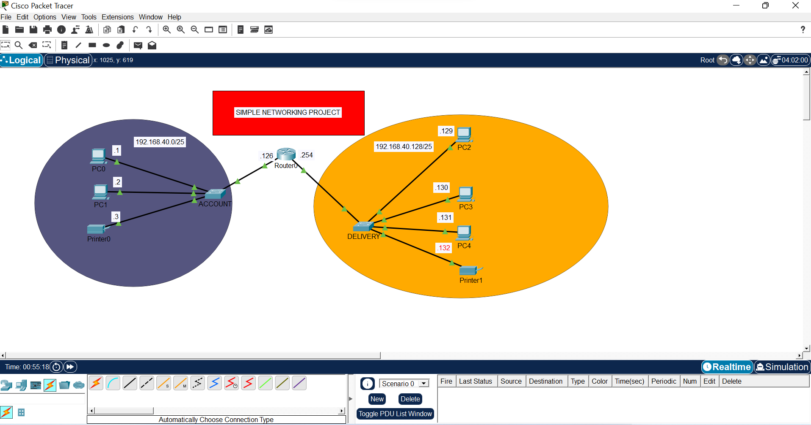
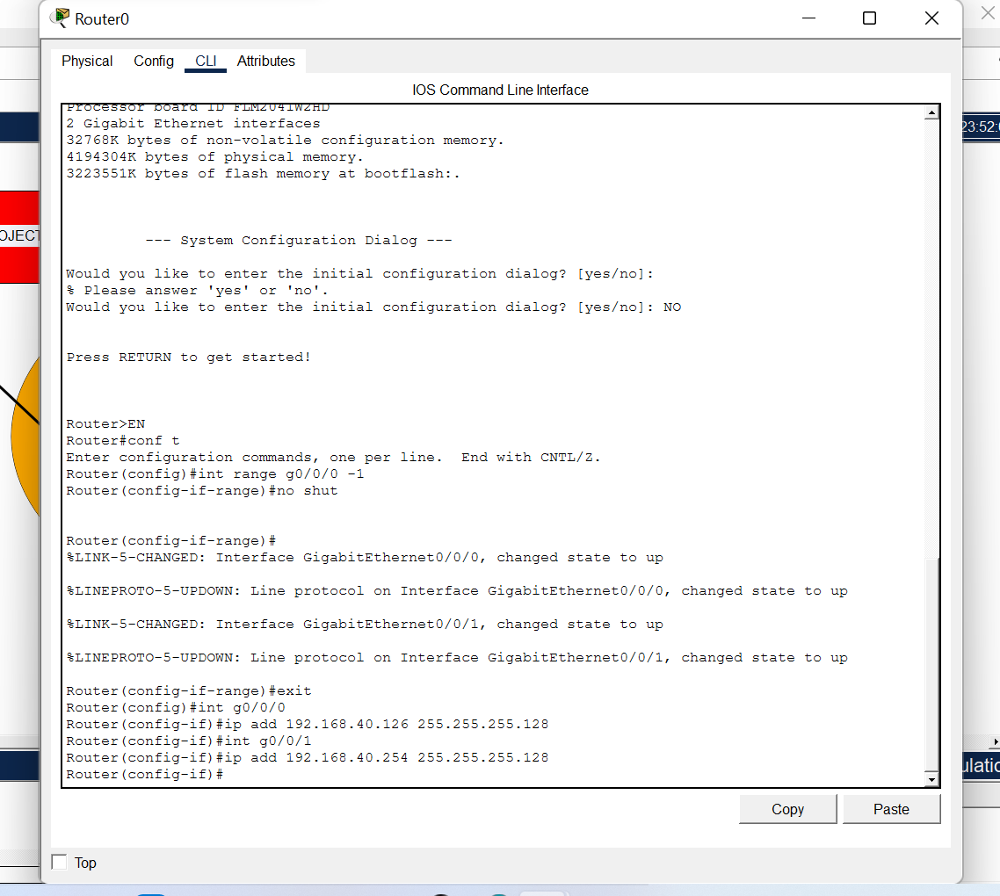
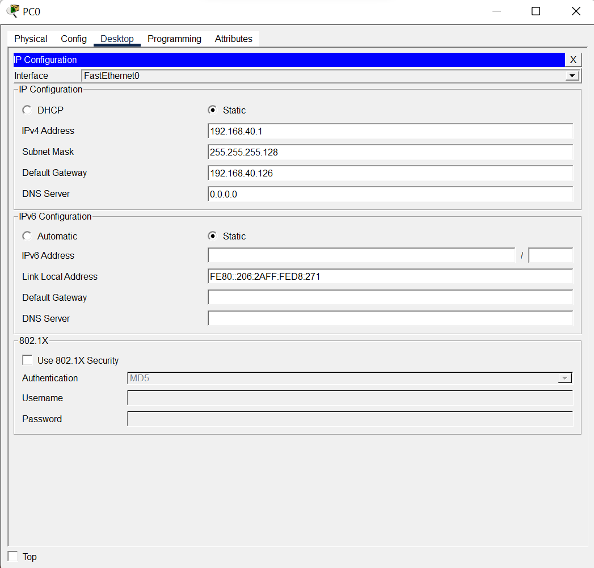
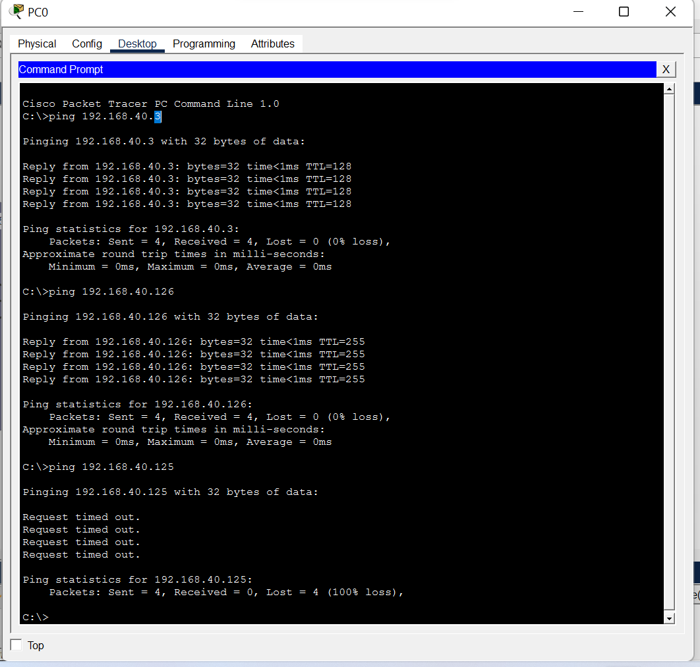
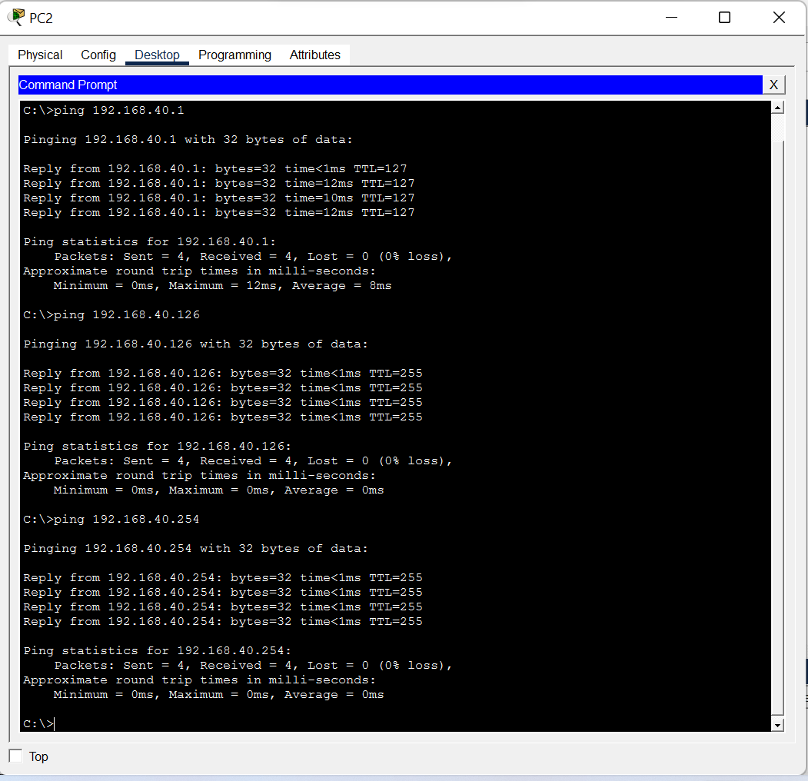
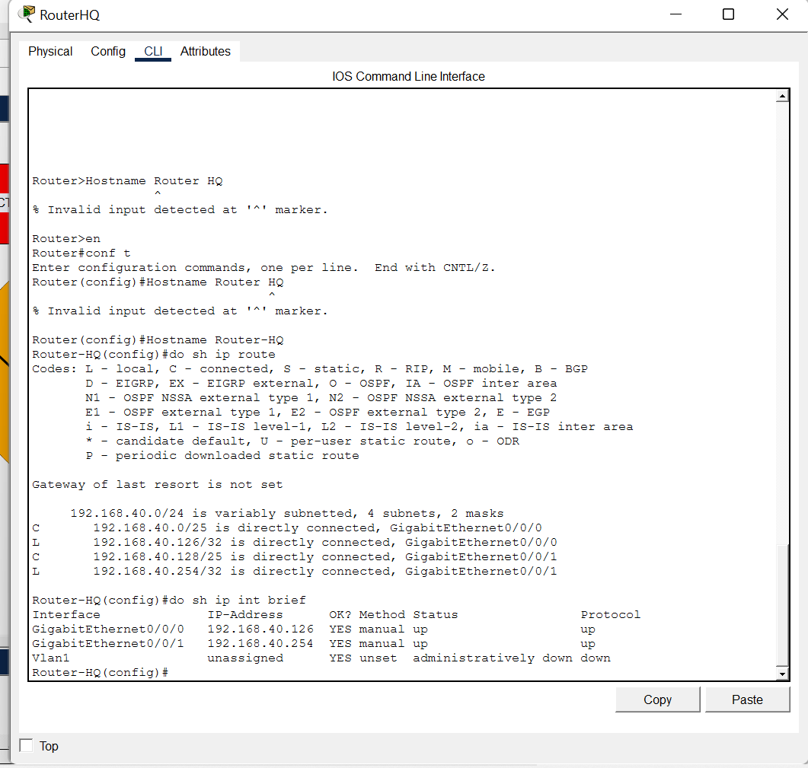

# 🌐 Inter-Departmental Enterprise Network Simulation

> **A Cisco Packet Tracer lab demonstrating core routing, subnetting, and network validation between distinct departmental broadcast domains.**

---

## 📋 Project Objective
This project showcases the design and configuration of a segmented enterprise network topology. The objective is to isolate and route traffic between an **Accounts** department and a **Delivery** department using a single, subnetted Class C address block, ensuring proper network segmentation and end-to-end connectivity.

---

## 🏗️ Network Architecture & Topology

The network was designed utilizing a single `192.168.40.0/24` address block, subnetted into two discrete `/25` networks. 
* **Routing:** A central Cisco ISR routes traffic between the directly connected subnets.
* **Switching:** Dedicated Layer 2 switches aggregate end-user devices (PCs and networked printers) for each department.

*Figure 1: Logical topology displaying the Accounts and Delivery broadcast domains.*

---

## 🧮 IP Addressing Scheme

| Department | Network Address | Subnet Mask | Usable Host Range | Default Gateway |
| :--- | :--- | :--- | :--- | :--- |
| **Accounts** | `192.168.40.0/25` | `255.255.255.128` | `.1 - .126` | `192.168.40.126` |
| **Delivery** | `192.168.40.128/25` | `255.255.255.128` | `.129 - .254` | `192.168.40.254` |

---

## ⚙️ Configuration Highlights

### Technologies & Protocols
* **IPv4 Subnetting:** Custom `/25` boundaries maximizing host availability per department.
* **Cisco IOS CLI:** Interface bring-up and gateway IP assignment.
* **ICMP:** End-to-end connectivity verification and troubleshooting.

*Figure 2: Cisco IOS CLI configuration bringing up GigabitEthernet interfaces.*

*Figure 3: Static IPv4 configuration and gateway assignment for end devices.*

---

## 🧪 Testing & Validation

Connectivity was fully validated using ICMP echo requests, proving the routing table is correctly populated and inter-VLAN routing is functional.
* **Accounts to Delivery:** `PC0` successfully pinged remote hosts in the Delivery subnet.
* **Delivery to Accounts:** `PC2` successfully pinged devices across the router in the Accounts subnet.

*Figure 4: Successful ICMP echo replies from the Accounts department to the Delivery department.*

*Figure 5: Successful ICMP echo replies from the Delivery department to the Accounts department.*

*Figure 6: shows the ip route table and ip address.*

---

## 📂 How to Run This Lab
1. Download the `vin project-inter-Departmental Enterprise Network Simulation` file from this repository.
2. Open the file using **Cisco Packet Tracer**.
3. Hover over the router to view the port states or open the CLI to review the `show ip route` and `show ip int brief` outputs.
